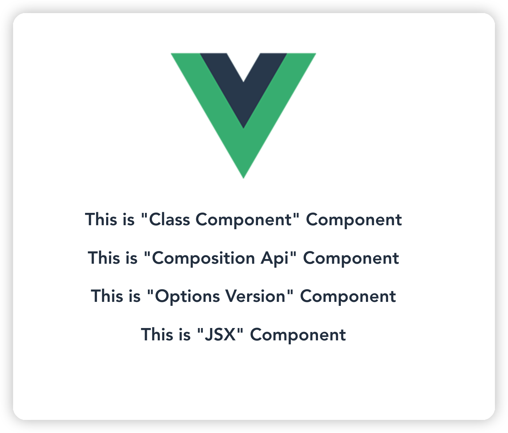

# Vue template 2.7

> Using the vue 2.7 version of the template



## Get Start

```bash
vue init -c taixw2/vue-template-2.7 my-project
# or
git clone -b main https://github.com/taixw2/vue-template-2.7 my-project
```

## Build Setup

``` bash
# install dependencies
npm install

# serve with hot reload at localhost:8080
npm run dev

# build for production with minification
npm run build

# build for production and view the bundle analyzer report
npm run build --report
```

